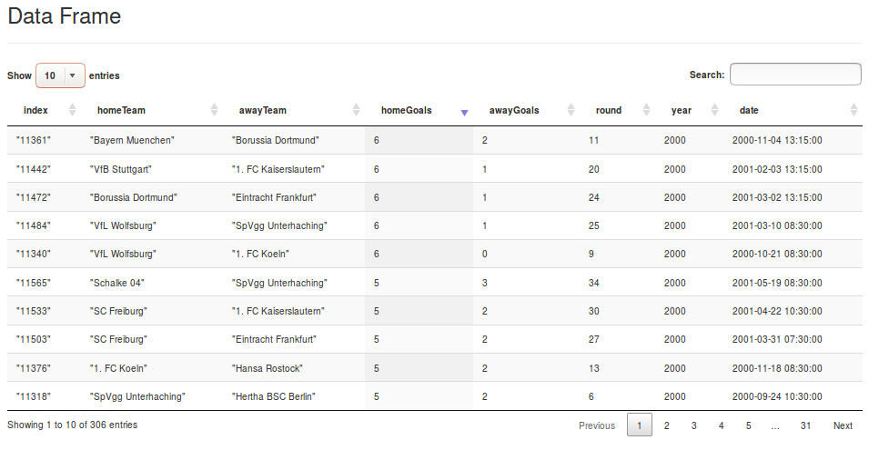

# NimData  [](https://travis-ci.org/bluenote10/NimData) [](LICENSE) <a href="https://github.com/yglukhov/nimble-tag"></a>

## Overview

**NimData** is a data manipulation and analysis library for the Nim programming language. It combines Pandas-like syntax with the type-safe, lazy APIs of distributed frameworks like Spark/Flink/Thrill. Although NimData is  currently non-distributed, it harnesses the power of Nim to perform out-of-core processing at native speed.

NimData's core data type is the generic `DataFrame[T]`. All `DataFrame` methods are based on the MapReduce paradigm and fall into two categories:

- **Transformations**: Operations like `map` or `filter` transform one `DataFrame` into another. Transformations are lazy and can be chained. They will only be executed once an *action* is called.
- **Actions**: Operations like `count`, `min`, `max`, `sum`, `reduce`, `fold`, `collect`, or `show` perform an aggregation on a `DataFrame`, and trigger the processing pipeline.

For a complete list of NimData's supported operations, see the
[module docs](https://bluenote10.github.io/NimData/nimdata.html).


## Installation

1. [Install Nim](https://nim-lang.org/install.html) and ensure that both Nim and Nimble (Nim's package manager) are added to your PATH. 
2. From the command line, run `$ nimble install NimData` (this will download NimData's source from GitHub to `~/.nimble/pkgs`).


## Quickstart

### Hello, World!

Once NimData is installed, we'll write a simple program to test it. Create a new file named `test.nim` with the following contents:

```nim
import nimdata

echo DF.fromRange(0, 10).collect()
```

From the command line, use `$ nim c -r test.nim` to compile and run the program (`c` for *compile*, and `-r` to *run* directly after compilation). It should print this [sequence](https://nim-by-example.github.io/seqs/): 
```nim
# => @[0, 1, 2, 3, 4, 5, 6, 7, 8, 9]
```

_Pandas users_: This is roughly equivalent to `print(pd.DataFrame(range(10))[0].values)`


### Reading raw text data

Next we'll use [this](examples/Bundesliga.csv) German soccer data set to explore NimData's main functionality.

To create a `DataFrame` which simply iterates over the raw text content
of a file, we can use `DF.fromFile()`:

```nim
let dfRawText = DF.fromFile("examples/Bundesliga.csv")
```

Note that `fromFile()` is a *lazy* operation, meaning that NimData doesn't actually read the contents of the file yet. To read the file, we need to call an *action* on our dataframe.

Calling `count()`, for example, triggers a line-by-line reading of the file and returns the number of rows:

```nim
echo dfRawText.count()
# => 14018
```

We can perform multiple operations on `dfRawText`. For example, we can use `take(5)` to filter the file down to its first five rows, and `show` to print the result:

```nim
dfRawText.take(5).show()
# =>
# "1","Werder Bremen","Borussia Dortmund",3,2,1,1963,1963-08-24 09:30:00
# "2","Hertha BSC Berlin","1. FC Nuernberg",1,1,1,1963,1963-08-24 09:30:00
# "3","Preussen Muenster","Hamburger SV",1,1,1,1963,1963-08-24 09:30:00
# "4","Eintracht Frankfurt","1. FC Kaiserslautern",1,1,1,1963,1963-08-24 09:30:00
# "5","Karlsruher SC","Meidericher SV",1,4,1,1963,1963-08-24 09:30:00
```

_Pandas users_: This is equivalent to `print(dfRawText.head(5))`.

Note, however, that every time an action is called, the file is read from scratch, which is inefficient. We'll improve on that in a moment.

### Type-safe schema parsing

At this stage, `dfRawText`'s data type is a plain `DataFrame[string]`. Let's transform our dataframe into something more useful for analysis:

```nim
const schema = [
  strCol("index"),
  strCol("homeTeam"),
  strCol("awayTeam"),
  intCol("homeGoals"),
  intCol("awayGoals"),
  intCol("round"),
  intCol("year"),
  dateCol("date", format="yyyy-MM-dd hh:mm:ss")
]
let df = dfRawText.map(schemaParser(schema, ','))
                  .map(record => record.projectAway(index))
                  .cache()
```

This code does three things:

1. The [`schemaParser` macro](https://bluenote10.github.io/NimData/nimdata/schema_parser.html#12) constructs a specialized parsing function for each field, which takes a string as input and returns a type-safe named tuple corresponding to the type definition in `schema`. For instance, `dateCol("date")` tells the parser that the last column is named "date" and contains `datetime` values. We can even specify the datetime format by passing a format string to `dateCol()` as a named parameter. A key benefit of defining the schema at compile time is that the parser produces highly optimized machine code, resulting in very fast performance.

2. The `projectAway()` macro transforms the results of `schemeParser` into a new dataframe with the "index" column removed, since it isn't a proper index anyway but rather a column of [string literals](https://nim-lang.org/docs/manual.html#lexical-analysis-generalized-raw-string-literals) (_Pandas users_: this is roughly equivalent to `dfRawText.drop(columns=['index'])`). See also `projectTo`, which instead _keeps_ certain fields, and `addFields`, which extends the schema by new fields.

3. The `cache()` method stores the parsing result in memory. This allows us to perform multiple actions on the data without having to re-read the file contents every time. _Spark users_: In contrast to Spark, `cache()` is currently implemented as an action.


Now we can perform the same operations as before, but this time our dataframe contains the parsed tuples:

```nim
echo df.count()
# => 14018

df.take(5).show()
# =>
# +------------+------------+------------+------------+------------+------------+------------+
# | homeTeam   | awayTeam   |  homeGoals |  awayGoals |      round |       year | date       |
# +------------+------------+------------+------------+------------+------------+------------+
# | "Werder B… | "Borussia… |          3 |          2 |          1 |       1963 | 1963-08-2… |
# | "Hertha B… | "1. FC Nu… |          1 |          1 |          1 |       1963 | 1963-08-2… |
# | "Preussen… | "Hamburge… |          1 |          1 |          1 |       1963 | 1963-08-2… |
# | "Eintrach… | "1. FC Ka… |          1 |          1 |          1 |       1963 | 1963-08-2… |
# | "Karlsruh… | "Meideric… |          1 |          4 |          1 |       1963 | 1963-08-2… |
# +------------+------------+------------+------------+------------+------------+------------+
```

Note that instead of starting the pipeline from `dfRawText` and using
caching, we could always write the pipeline from scratch:

```nim
DF.fromFile("examples/Bundesliga.csv")
  .map(schemaParser(schema, ','))
  .map(record => record.projectAway(index))
  .take(5)
  .show()
```

### Filter

Data can be filtered by using `filter`. For instance, we can filter the data to get games
of a certain team only:

```nim
import strutils

df.filter(record =>
    record.homeTeam.contains("Freiburg") or
    record.awayTeam.contains("Freiburg")
  )
  .take(5)
  .show()
# =>
# +------------+------------+------------+------------+------------+------------+------------+
# | homeTeam   | awayTeam   |  homeGoals |  awayGoals |      round |       year | date       |
# +------------+------------+------------+------------+------------+------------+------------+
# | "Bayern M… | "SC Freib… |          3 |          1 |          1 |       1993 | 1993-08-0… |
# | "SC Freib… | "Wattensc… |          4 |          1 |          2 |       1993 | 1993-08-1… |
# | "Borussia… | "SC Freib… |          3 |          2 |          3 |       1993 | 1993-08-2… |
# | "SC Freib… | "Hamburge… |          0 |          1 |          4 |       1993 | 1993-08-2… |
# | "1. FC Ko… | "SC Freib… |          2 |          0 |          5 |       1993 | 1993-09-0… |
# +------------+------------+------------+------------+------------+------------+------------+
```
_Note: Without the `strutils` module, `contains` will throw a type error here._

Or search for games with many home goals:

```nim
df.filter(record => record.homeGoals >= 10)
  .show()
# =>
# +------------+------------+------------+------------+------------+------------+------------+
# | homeTeam   | awayTeam   |  homeGoals |  awayGoals |      round |       year | date       |
# +------------+------------+------------+------------+------------+------------+------------+
# | "Borussia… | "Schalke … |         11 |          0 |         18 |       1966 | 1967-01-0… |
# | "Borussia… | "Borussia… |         10 |          0 |         12 |       1967 | 1967-11-0… |
# | "Bayern M… | "Borussia… |         11 |          1 |         16 |       1971 | 1971-11-2… |
# | "Borussia… | "Borussia… |         12 |          0 |         34 |       1977 | 1978-04-2… |
# | "Borussia… | "Arminia … |         11 |          1 |         12 |       1982 | 1982-11-0… |
# | "Borussia… | "Eintrach… |         10 |          0 |          8 |       1984 | 1984-10-1… |
# +------------+------------+------------+------------+------------+------------+------------+
```

Note that we can now fully benefit from type-safety:
The compiler knows the exact fields and types of a record.
No dynamic field lookup and/or type casting is required.
Assumptions about the data structure are moved to the earliest
possible step in the pipeline, allowing to fail early if they
are wrong. After transitioning into the type-safe domain, the
compiler helps to verify the correctness of even long processing
pipelines, reducing the risk of runtime errors.

Other filter-like transformation are:

- `take`, which takes the first N records as already seen.
- `drop`, which discard the first N records.
- `filterWithIndex`, which allows to define a filter function that take both the index and the elements as input.

### Collecting data

A `DataFrame[T]` can be converted easily into a `seq[T]` (Nim's native dynamic
arrays) by using `collect`:

```nim
echo df.map(record => record.homeGoals)
       .filter(goals => goals >= 10)
       .collect()
# => @[11, 10, 11, 12, 11, 10]
```

### Numerical aggregation

A DataFrame of a numerical type allows to use functions like `min`/`max`/`mean`.
This allows to get things like:

```nim
echo "Min date: ", df.map(record => record.year).min()
echo "Max date: ", df.map(record => record.year).max()
echo "Average home goals: ", df.map(record => record.homeGoals).mean()
echo "Average away goals: ", df.map(record => record.awayGoals).mean()
# =>
# Min date: 1963
# Max date: 2008
# Average home goals: 1.898130974461407
# Average away goals: 1.190754743900699

# Let's find the highest defeat
let maxDiff = df.map(record => (record.homeGoals - record.awayGoals).abs).max()
df.filter(record => (record.homeGoals - record.awayGoals) == maxDiff)
  .show()
# =>
# +------------+------------+------------+------------+------------+------------+------------+
# | homeTeam   | awayTeam   |  homeGoals |  awayGoals |      round |       year | date       |
# +------------+------------+------------+------------+------------+------------+------------+
# | "Borussia… | "Borussia… |         12 |          0 |         34 |       1977 | 1978-04-2… |
# +------------+------------+------------+------------+------------+------------+------------+
```

### Sorting

A `DataFrame` can be transformed into a sorted `DataFrame` by the `sort()` method.
Without specifying any arguments, the operation would sort using default
comparison over all columns. By specifying a key function and the sort order,
we can for instance rank the games by the number of away goals:

```nim
df.sort(record => record.awayGoals, SortOrder.Descending)
  .take(5)
  .show()
# =>
# +------------+------------+------------+------------+------------+------------+------------+
# | homeTeam   | awayTeam   |  homeGoals |  awayGoals |      round |       year | date       |
# +------------+------------+------------+------------+------------+------------+------------+
# | "Tasmania… | "Meideric… |          0 |          9 |         27 |       1965 | 1966-03-2… |
# | "Borussia… | "TSV 1860… |          1 |          9 |         29 |       1965 | 1966-04-1… |
# | "SSV Ulm"  | "Bayer Le… |          1 |          9 |         25 |       1999 | 2000-03-1… |
# | "Rot-Weis… | "Eintrach… |          1 |          8 |         32 |       1976 | 1977-05-0… |
# | "Borussia… | "Bayer Le… |          2 |          8 |         10 |       1998 | 1998-10-3… |
# +------------+------------+------------+------------+------------+------------+------------+
```

### Unique values

The `DataFrame[T].unique()` transformation filters a `DataFrame` to unique elements.
This can be used for instance to find the number of teams that appear in the data:

```nim
echo df.map(record => record.homeTeam).unique().count()
# => 52
```

_Pandas user note_: In contrast to Pandas, there is no differentiation between
a one-dimensional series and multi-dimensional `DataFrame` (`unique` vs `drop_duplicates`).
`unique` works the same in for any hashable type `T`, e.g., we might as well get
a `DataFrame` of unique pairs:

```nim
df.map(record => record.projectTo(homeTeam, awayTeam))
  .unique()
  .take(5)
  .show()
# =>
# +------------+------------+
# | homeTeam   | awayTeam   |
# +------------+------------+
# | "Werder B… | "Borussia… |
# | "Hertha B… | "1. FC Nu… |
# | "Preussen… | "Hamburge… |
# | "Eintrach… | "1. FC Ka… |
# | "Karlsruh… | "Meideric… |
# +------------+------------+
```

### Value counts

The `DataFrame[T].valueCounts()` transformation extends the functionality of
`unique()` by returning the unique values and their respective counts.
The type of the transformed `DataFrame` is a tuple of `(key: T, count: int)`,
where `T` is the original type.

In our example, we can use `valueCounts()` for instance to find the most
frequent results in German soccer:

```nim
df.map(record => record.projectTo(homeGoals, awayGoals))
  .valueCounts()
  .sort(x => x.count, SortOrder.Descending)
  .map(x => (
    homeGoals: x.key.homeGoals,
    awayGoals: x.key.awayGoals,
    count: x.count
  ))
  .take(5)
  .show()
# =>
# +------------+------------+------------+
# |  homeGoals |  awayGoals |      count |
# +------------+------------+------------+
# |          1 |          1 |       1632 |
# |          2 |          1 |       1203 |
# |          1 |          0 |       1109 |
# |          2 |          0 |       1092 |
# |          0 |          0 |        914 |
# +------------+------------+------------+
```

This transformation first projects the data onto a named tuple of
`(homeGoals, awayGoals)`. After applying `valueCounts()` the data
frame is sorted according to the counts. The final `map()` function
is purely for cosmetics of the resulting table, projecting the nested
`(key: (homeGaols: int, awayGoals: int), counts: int)` tuple back
to a flat result.

### `DataFrame` viewer

`DataFrame`s can be opened and inspected in the browser by using `df.openInBrowser()`,
which offers a simple Javascript based data browser:



Note that the viewer uses static HTML, so it should only be applied to small
or heavily filtered `DataFrame`s.


## Benchmarks

More meaningful benchmarks are still on the todo list. This just shows a
few first results. The benchmarks will be split into small (data
which fits into memory so we can compare against Pandas or R easily) and
big (where we can only compare against out-of-core frameworks).

All implementations are available in the [benchmarks](benchmarks) folder.

### Basic operations (small data)

The test data set is 1 million rows CSV with two int and two float columns.
The test tasks are:

- Parse/Count: Just the most basic operations -- iterating the file, applying
parsing, and return a count.
- Column Averages: Same steps, plus an additional computation of all 4 column means.

The results are average runtime in seconds of three runs:

| Task                    |          NimData |           Pandas |  Spark (4 cores) |   Dask (4 cores) |
|:------------------------|-----------------:|-----------------:|-----------------:|-----------------:|
| Parse/Count             |            0.165 |            0.321 |            1.606 |            0.182 |
| Column Averages         |            0.259 |            0.340 |            1.179 |            0.622 |

Note that Spark internally caches the file over the three runs, so the first iteration
is much slower (with > 3 sec) while it reaches run times of 0.6 sec in the last iterations
(obviously the data is too small to justify the overhead anyway).


## Next steps

- More transformations:
  - [x] map
  - [x] filter
  - [x] flatMap
  - [x] sort
  - [x] unique
  - [x] valueCounts
  - [x] groupBy (reduce)
  - [ ] groupBy (transform)
  - [x] join (inner)
  - [ ] join (outer)
  - [ ] concat/union
  - [ ] window
- More actions:
  - [x] numerical aggergations (count, min, max, sum, mean)
  - [x] collect
  - [x] show
  - [x] openInBrowser
- More data formats/sources
  - [x] csv
  - [x] gzipped csv
  - [ ] parquet
  - [ ] S3
- REPL or Jupyter kernel?
- Plotting (maybe in the form of Bokeh bindings)?

## License

This project is licensed under the terms of the MIT license.
